# Supervised-ML_showcase_ClimateWins :earth_africa:
***A comparison study of supervised classification algorithms (KNN, ANN and Decision tree)***

## 1. Context
As a data analyst within the non profit organisation called ClimateWins, my first task is to investigate if machine learning models can predict whether the weather will be pleasant on a given day, based on several recorded weather conditions (wind speed, temperature, humidity, precipitations, etc.). 

Hence, there main concerns are:
- How is machine learning used? Is it applicable to weather data?
- Are there any ethical concerns specific to this project?
- Can machine learning be used to predict whether weather conditions will be favorable on a certain day? (If so, it could also be possible to predict danger.)

## 2. Data set & tools
### DATA:
-**Weather conditions data set**

The data set is owned and collected by the [European Climate Assessment & Data Set Project.](https://www.ecad.eu/). It holds daily weather metrics (temperatures, wind speed, humidity, precipitation, etc.) for a selection of 18 weather stations in Europe, and its span is a sample from January 1960, to October 2022.

The csv file is available [here](https://s3.amazonaws.com/coach-courses-us/public/courses/da-spec-ml/Scripts/A1/Dataset-weather-prediction-dataset-processed.csv).

-**Pleasant/unpleasant labels data set**

The data set is corresponding to the same time period and for 15 weather stations, with tags indicating whether the weather is labeled as pleasant or not. It was generated by ClimateWins for the purpose of training the classification models.

The csv file is available [here](https://s3.amazonaws.com/coach-courses-us/public/courses/da-spec-ml/Scripts/A1/Dataset-Answers-Weather_Prediction_Pleasant_Weather.csv)

### TOOLS

The main tool used for this study is Python using the [Jupyter notebook](https://jupyter.org/) (links to the scripts bellow), with the dedicated libraries Pandas, Numpy, [Scikit-learn](https://scikit-learn.org/stable/) for machine learning models, and [Graphviz](https://graphviz.org/) for decision tree visualizations.

## 3. Analysis (python scripts for each step)

[**a. Data scaling:**](Scripts/1_Data_scaling.ipynb) A quick data cleaning was necessary, mostly on the dates formats, then the standard scaler (means of 0 and std of 1) from sklearn was used upon all numerical variables, namely the weather metrics for all the 28 stations. Since the units of each variable is different, there were gaps when comparing Celsius degrees with squared milimeters of precipitations. Some of the models do not need a scaled data set to work on, but it was still interesting to have a scaled data set at hand.

[**b. Optimization (Gradient descent):**](Scripts/2_Gradient-Descent-for-Temperatures_light.ipynb) The gradient descent was used on the daily mean temperatures for three stations accross Europe and for the years 1960, 1990 and 2009. It's main purpose was to further explore the data set and its readiness for the classification models.

Insights from the three stations:
- Tours (France): Temperatures in 1960 were very low, in 1990 they had the highest range with very high temperatures, and 2009 seems more evened.
- Budapest (Hungary): Overall temperatures have increased, with a mean range from -0.06 to 0.09. The minimum temperature was lowest in 2009, indicating that rising temperatures might also lead to very cold winters
- Rome (Italy): Temperatures are rising steadily, despite a slight dip in 1990. The maximum temperature in 2009 increased by about a third compared to 1960.

[**c. K-Nearest Neighbor (KNN):**](Scripts/3_KNN.ipynb) Initially, I applied the KNN model to the entire dataset to predict tags for pleasant or unpleasant days, achieving a 90% accuracy score, 85% precision score, and 84% recall score. While the results are decent, they are not perfect, indicating potential underfitting or overfitting. It resulted that the model, when learning from all weather stations simultaneously for the same day, can become too complex and lose accuracy due to noise and outliers.

In other words, in my initial model, weather conditions in Madrid impacted the labeled weather in Stockholm, which is clearly absurd!

The final confusion matrix on the testing data is as follow and illustrates the overall 94,3% accuracy of the KNN model:

The confusion matrix nuances the accuracy, showing that the tags for well performing weather stations like Valentia are not very well balanced (ratio of tags), having more false negatives.

[**d. Decision Tree:**](Scripts/4_Decision_Tree.ipynb) Surprisingly, this algorithm achieved a 100% accuracy score when the model checked the label for its weather station metrics, reaching a conclusion in only three steps.
Here is an example of the Decison tree from Madrid:

ince the metrics were consistent across all weather stations, we can summarize the model as follows:

```mermaid
flowchart LR
A{Temperature <= 17,95°C ?}
A -->|YES| B[Unpleasant]
A -->|NO| C{precipitations <=5 ml ?}
C -->|YES| D[Unpleasant]
C -->|NO| E{sunshine <= 0,95 ?}
E -->|YES| F[Unpleasant]
E -->|NO| G[Pleasant !]
```

Maybe rnarrowing down the metrics to only these three might help the KNN performing better in future instances...

[**e. Artificial Neural Network (ANN):**](Scripts/5_ANN.ipynb) With a global accuracy score of 99.77%, the ANN performed very well when its parameters involved no more than 500 iterations, a tolerance not lower than 0.000, and only two hidden layers of 5 nodes each. When I tried higher parameter values, the accuracy dropped, indicating that the model might become too complicated over time.
The confusion matrix on the testing data shows that the model best performs on the stations were there are balanced pleasant and unpleasant days, like Belgrade and Madrid:

### Comparing the accuracy scores of the three algorithms
| Weather Station | KNN | Decision Tree | ANN |
|----------------|--------------|------------------------|--------------|
| Basel | 🟨 93.22% | 🟢 100% | 🟨 99.87% |
| Belgrade | 🟥 91.78% | 🟢 100% | 🟩 99.96% |
| Budapest | 🟨 93.70% | 🟢 100% | 🟩 99.96% |
| Debilt | 🟨 93.48% | 🟢 100% | 🟩 99.94% |
| Dusseldorf | 🟨 93.32% | 🟢 100% | 🟨 99.36% |
| Heathrow | 🟨 93.36% | 🟢 100% | 🟩 99.91% |
| Kassel | 🟨 94.95% | 🟢 100% | 🟩 99.88% |
| Ljubljana | 🟥 91.29% | 🟢 100% | 🟨 99.85% |
| Maastricht | 🟨 93.87% | 🟢 100% | 🟩 99.93% |
| Madrid | 🟨 93.70% | 🟢 100% | 🟨 99.74% |
| Munchenb | 🟨 93.93% | 🟢 100% | 🟨 99.84% |
| Oslo | 🟨 94.42% | 🟢 100% | 🟨 99.24% |
| Sonnblick | 🟩 100% | 🟢 100% | 🟩 100% |
| Stockholm | 🟨 95.90% | 🟢 100% | 🟨 99.55% |
| Valentia | 🟩 97.60% | 🟢 100% | 🟨 99.56% |
| **Total Mean** | **🟨 94.30%** | **🟢 100%** | **🟩 99.77%** |

> [!NOTE]
>Sonnblick, in the Austrian Alps, only has days tagged as unpleasant, so the models all guessed it right.

## 4. Interim presentation
[Power point presentation to stakeholders, with recommendations to ClimateWins](Interim_report/Findings_presentation.pdf)
