# Supervised-ML_showcase_ClimateWins :earth_africa:
***A comparison study of supervised classification algorithms (KNN, ANN and Decision tree)***

## 1. Context
As the data analyst within the non profit organisation called ClimateWins, my first task is to investigate if machine learning models can predict whether the weather will be pleasant on a given day, based on several recorded weather conditions (wind speed, temperature, humidity, precipitations, etc.). 

Hence, there main concerns are:
- How is machine learning used? Is it applicable to weather data?
- Are there any ethical concerns specific to this project?
- Can machine learning be used to predict whether weather conditions will be favorable on a certain day? (If so, it could also be possible to predict danger.)

## 2. Data set & tools
### DATA:
-**Weather conditions data set**

The data set is owned and collected by the [European Climate Assessment & Data Set Project.](https://www.ecad.eu/). It holds daily weather metrics (temperatures, wind speed, humidity, precipitation, etc.) for a selection of 18 weather stations in Europe, and its span is a sample from January 1960, to October 2022.

The csv file is available [here](https://s3.amazonaws.com/coach-courses-us/public/courses/da-spec-ml/Scripts/A1/Dataset-weather-prediction-dataset-processed.csv).

-**Pleasant/unpleasant labels data set**

The data set is corresponding to the same time period and for 15 weather stations, with tags indicating whether the weather is labeled as pleasant or not. It was generated by ClimateWins for the purpose of training the classification models.

The csv file is available [here](https://s3.amazonaws.com/coach-courses-us/public/courses/da-spec-ml/Scripts/A1/Dataset-Answers-Weather_Prediction_Pleasant_Weather.csv)

### TOOLS

The main tool used for this study is Python using the [Jupyter notebook](https://jupyter.org/) (links to the scripts bellow), with the dedicated libraries Pandas, Numpy, [Scikit-learn](https://scikit-learn.org/stable/) for machine learning models, and [Graphviz](https://graphviz.org/) for decision tree visualizations.

## 3. Analysis (python scripts for each step)

[**a. Data scaling:**](Scripts/1_Data_scaling.ipynb) A quick data cleaning was necessary, mostly on the dates formats, then the standard scaler (means of 0 and std of 1) from sklearn was used upon all numerical variables, namely the weather metrics for all the 28 stations. Since the units of each variable is different, there were gaps when comparing Celsius degrees with squared milimeters of precipitations. Some of the models do not need a scaled data set to work on, but it was still interesting to have a scaled data set at hand.

[**b. Optimization (Gradient descent):**](Scripts/2_Gradient-Descent-for-Temperatures_light.ipynb) The gradient descent was used on the daily mean temperatures for three stations accross Europe and for the years 1960, 1990 and 2009. It's main purpose was to further explore the data set and its readiness for the classification models.

Insights from the three stations:
- Tours (France): Temperatures in 1960 were very low, in 1990 they had the highest range with very high temperatures, and 2009 seems more evened.
- Budapest (Hungary): There is an overall increase of temperatures with a mean from -0,06 to 0,09, while the min temperature is the lowest in 2009: the increase of temperatures might cause also very cold winters.
- Rome (Italy): Temperatures are changing with a slanted positive rise, even though 1990 has been a little colder. The max temperature in 2009 represent an increase of about a third of 1960’ max.

[**c. K-Nearest Neighbor (KNN):**](Scripts/3_KNN.ipynb) At first, I applied the KNN model on the whole data set in order ot predict all tags for pleasant or unpleasant days, resulting in a 90% accuracy score, an 85% precision score and an 84% recall score. It looks okay, but not perfect, so is there any under or overfitting happening? It resulted that a model that learns from all weather stations at the same time for the same day can become too complex and **lose accuracy** due to noise and outliers in the data.

In other words, in my model at first, Weather conditions in Madrid had an impact on the labeled weather in Stockholm : absurd !

The final confusion matrix on the testing data is as follow and illustrates the overall 94,3% accuracy of the KNN model:

The confusion matrix nuances the accuracy, showing that the tags for well performing weather stations like Valentia are not very well balanced (ratio of tags), having more false negatives.

[**d. Decision Tree:**](Scripts/4_Decision_Tree.ipynb) This algorithm surprizingly had a 100% accuracy score once the model was checking the label for its weaether station metrics, and reach a conclusion in only three steps. Here is an example of the Decison tree from the Madrid:

Since the metrics were consistent for all the wether stations, we can then summarize the model like this:

```mermaid
flowchart LR
A{Temperature <= 17,95°C ?}
A -->|YES| B[Unpleasant]
A -->|NO| C{precipitations <=5 ml ?}
C -->|YES| D[Unpleasant]
C -->|NO| E{sunshine <= 0,95 ?}
E -->|YES| F[Unpleasant]
E -->|NO| G[Pleasant !]
```

Maybe rnarrowing down the metrics to only these three might help the KNN performing better in future instances...

[**e. Artificial Neural Network (ANN):**](Scripts/5_ANN.ipynb) With a global accuracy score of 99,77, the ANN performed very well when its parameters didn't involve too many iterations (max 500) with a tolerance not lower than 0,000 and with only two hidden layers of 5 nodes each. As I tried higher values in the parameters, its accuracy dropped meaning the model might get too complicated over time.
The confusion matrix on the testing data shows that the model best performs on the stations were there are balanced pleasant and unpleasant days, like Belgrade and Madrid:

### Comparing the accuracy scores of the three algorithms
| Weather Station | KNN | Decision Tree | ANN |
|----------------|--------------|------------------------|--------------|
| Basel | 🟨 93.22% | 🟢 100% | 🟨 99.87% |
| Belgrade | 🟥 91.78% | 🟢 100% | 🟩 99.96% |
| Budapest | 🟨 93.70% | 🟢 100% | 🟩 99.96% |
| Debilt | 🟨 93.48% | 🟢 100% | 🟩 99.94% |
| Dusseldorf | 🟨 93.32% | 🟢 100% | 🟨 99.36% |
| Heathrow | 🟨 93.36% | 🟢 100% | 🟩 99.91% |
| Kassel | 🟨 94.95% | 🟢 100% | 🟩 99.88% |
| Ljubljana | 🟥 91.29% | 🟢 100% | 🟨 99.85% |
| Maastricht | 🟨 93.87% | 🟢 100% | 🟩 99.93% |
| Madrid | 🟨 93.70% | 🟢 100% | 🟨 99.74% |
| Munchenb | 🟨 93.93% | 🟢 100% | 🟨 99.84% |
| Oslo | 🟨 94.42% | 🟢 100% | 🟨 99.24% |
| Sonnblick | 🟩 100% | 🟢 100% | 🟩 100% |
| Stockholm | 🟨 95.90% | 🟢 100% | 🟨 99.55% |
| Valentia | 🟩 97.60% | 🟢 100% | 🟨 99.56% |
| **Total Mean** | **🟨 94.30%** | **🟢 100%** | **🟩 99.77%** |

> [!NOTE]
>Sonnblick, in the Austrian Alps, only has days tagged as unpleasant, so the models all guessed it right.

## 4. Interim presentation
[Power point presentation to stakeholders, with recommendations to ClimateWins](Interim_report/Findings_presentation.pdf)
